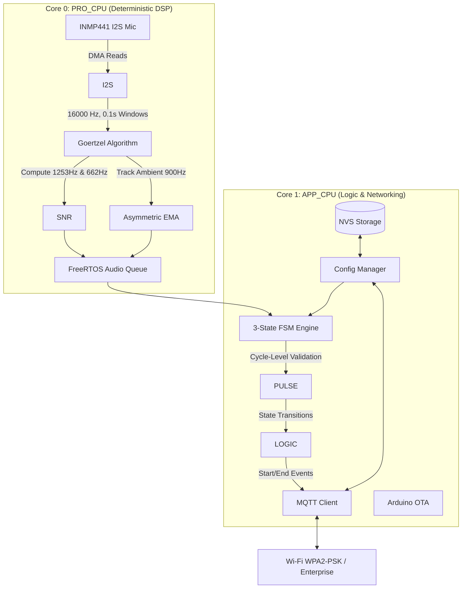
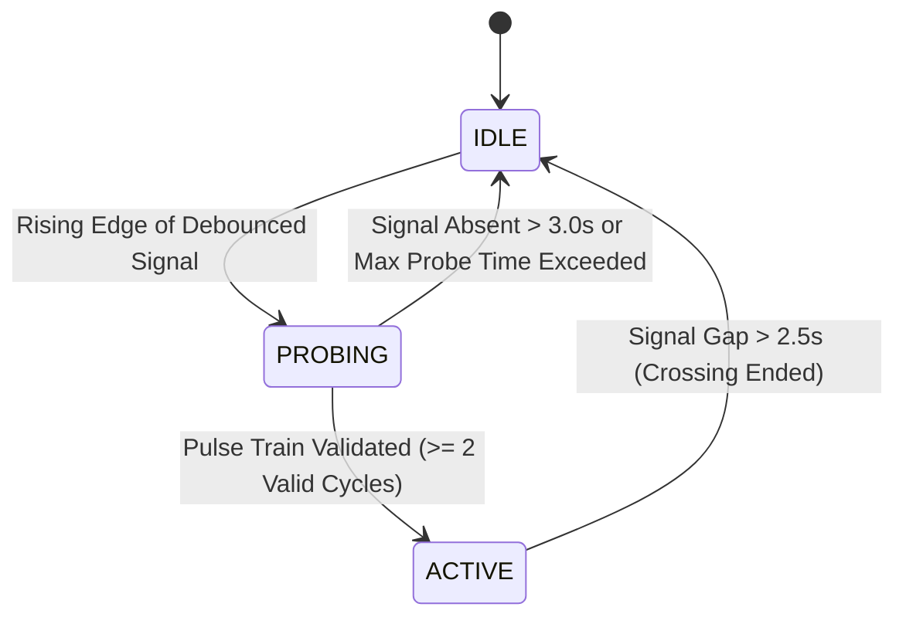

# Acoustic ATCS Proxy Node

## Overview

The Acoustic ATCS Proxy (AAP) Node is an edge device designed to monitor a black-box Adaptive Traffic Control System (ATCS) pedestrian crossing. Built around an ESP32 microcontroller and an I2S MEMS microphone, the device performs local Digital Signal Processing (DSP) to detect the specific acoustic signature and temporal pulsing rhythm of a crossing buzzer.

By analyzing the audio locally at the edge, the device completely eliminates the need to stream raw audio over the network. It publishes lightweight, highly confident `start` and `end` crossing events to a central server via MQTT, alongside periodic telemetry and heartbeat data. The device supports dynamic runtime configuration via MQTT and Over-The-Air (OTA) firmware updates.

## System Architecture

The firmware is built on the Arduino framework over ESP-IDF and utilizes FreeRTOS to guarantee deterministic audio sampling while handling asynchronous network events.



## Signal Processing Methodology

The device samples audio at 16,000 Hz and processes it in 0.1-second, non-overlapping windows (1,600 samples per window). It leverages the **Goertzel algorithm** to isolate specific frequencies without computing a full FFT, saving significant CPU cycles.

- **Primary Frequency ($f_{main}$):** $1253.0\text{ Hz}$ (The primary resonance frequency of the buzzer).
- **Secondary Frequency ($f_{sec}$):** $662.0\text{ Hz}$ (The fundamental buzzer frequency).
- **Ambient Baseline ($f_{amb}$):** $900.0\text{ Hz}$.

The ambient baseline tracks the dynamic noise floor (e.g., passing traffic, wind) using an Asymmetric Exponential Moving Average (EMA) to react quickly to noise spikes but decay slowly.

Signal detection requires the Signal-to-Noise Ratio (SNR) for both target frequencies to exceed strict thresholds:
$$ \text{SNR}_{main} = 10 \log_{10} \left( \frac{P*{main}}{P*{amb}} \right) \ge 25.0\text{ dB} $$
$$ \text{SNR}_{sec} = 10 \log_{10} \left( \frac{P*{sec}}{P*{amb}} \right) \ge 22.0\text{ dB} $$

These parameters are configurable at runtime via MQTT.

## Finite State Machine (FSM) & Pulse Validation

A simple spectral match is insufficient to prevent false alarms from sources like horns or other environmental noise in the same frequency band. The node employs a cycle-level pulse validation mechanism to ensure the detected signal matches the expected rhythmic 600 milliseconds on/off pattern of the pedestrian buzzer.



**Pulse Validation:**
The FSM tracks the time ($\Delta t$) between consecutive rising edges of the signal. A valid cycle must fall within a strict timing window:

- **Cycle Target:** $1200\text{ ms}$
- **Tolerance:** $\pm 300\text{ ms}$

The FSM requires at least 2 consecutive valid cycles to upgrade from `PROBING` to `ACTIVE`.

## MQTT Interface

The node communicates extensively over MQTT, allowing for both event logging and remote administration.

### Topics

- `crossing/event`: Crossing `started` and `ended` events.
- `crossing/heartbeat`: Periodic running status (every 60s).
- `crossing/telemetry`: Detailed system metrics (every 300s).
- `crossing/config`: Subscribe to push dynamic configuration updates.
- `crossing/config/ack`: Node acknowledges applied configurations here.
- `crossing/config/req`: Publish here to request the node's current config state.

### Event Payload Examples

**Start Event:**

```json
{
  "event": "started",
  "probing_started_at": 1780243200,
  "active_at": 1780243205,
  "timestamp": 1780243205
}
```

**End Event:**

```json
{
  "event": "ended",
  "ended_at": 1780243200,
  "duration": 25.0,
  "probing_started_at": 1780243200,
  "active_at": 1780243205,
  "timestamp": 1780243230
}
```

## Remote Configuration & NVS Persistence

The node features dynamic runtime configuration, which allows tuning of DSP thresholds, FSM timings, deep sleep schedules, and OTA/debug settings on-the-fly without requiring a reflash.

### Configuration Payload Schema

To update the config, publish a JSON payload to `crossing/config`. The message can contain any subset of the parameters below.

```json
{
  "persist": true,
  "main_snr_db": 25.0,
  "sec_snr_db": 22.0,
  "confirm_sec": 0.7,
  "probing_timeout_sec": 3.0,
  "active_timeout_sec": 2.5,
  "cycle_target_ms": 1200,
  "cycle_tolerance_ms": 300,
  "required_cycles": 2,
  "signal_streak_min": 2,
  "main_freq_hz": 1253.0,
  "sec_freq_hz": 662.0,
  "amb_freq_hz": 900.0,
  "alpha_attack": 0.01,
  "alpha_decay": 0.2,
  "deep_sleep_enabled": false,
  "sleep_start_hour": 22,
  "wake_end_hour": 5,
  "led_enabled": true,
  "ota_enabled": true,
  "ota_port": 3232,
  "debug_enabled": false
}
```

### Persistence Control (`persist` flag)

- **`persist: true`**: The node applies the incoming configuration parameters to RAM _and_ writes them to the ESP32's Non-Volatile Storage (NVS) inside the `rt_config` namespace. The parameters will persist across hardware reboots.
- **`persist: false` (or omitted)**: The parameters are only applied to the active running state in RAM. The configuration will revert to NVS-persisted values (or hardcoded compilation defaults) upon reboot.

### Configuration State Queries

- **Querying State**: Publish an empty message to the `crossing/config/req` topic.
- **State Acknowledgment**: The node replies by publishing its complete, current configuration payload to `crossing/config/ack`. This acknowledgment is also automatically published every time a config update is successfully processed.

## Hardware & Pinout

Designed for the ESP32 Development Board (e.g., `esp32doit-devkit-v1`), utilizing an INMP441 I2S microphone.

| Component     | ESP32 GPIO | Function                                         |
| :------------ | :--------- | :----------------------------------------------- |
| INMP441       | `GPIO 21`  | I2S Word Select (WS / LRCLK)                     |
| INMP441       | `GPIO 19`  | I2S Bit Clock (SCK / BCLK)                       |
| INMP441       | `GPIO 18`  | I2S Serial Data (SD / DOUT)                      |
| INMP441 (L/R) | `GND`      | Tie to Ground for Left Channel                   |
| Status LED    | `GPIO 2`   | Built-in LED: Off=IDLE, Blink=PROBING, On=ACTIVE |

## Setup & Configuration

1. Copy `include/secrets.h.example` to `include/secrets.h`.
2. Populate your Wi-Fi credentials (WPA2-PSK or Enterprise) and your MQTT broker IP.
3. Build and upload using PlatformIO.
4. Future updates can be pushed over-the-air (OTA) via port `3232`.

## The Team

Chr